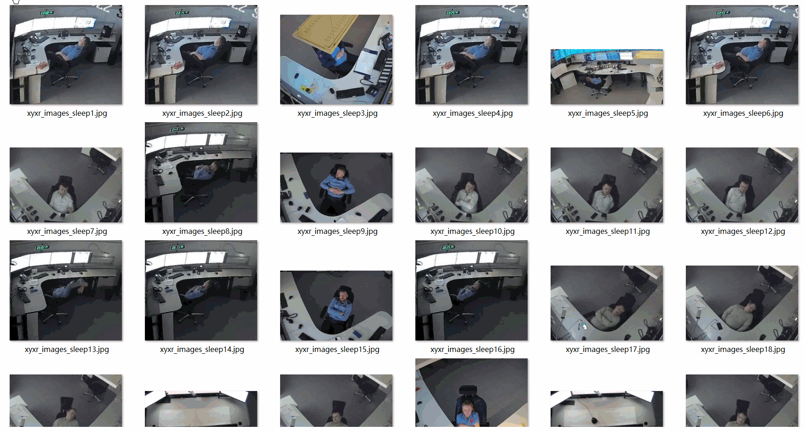
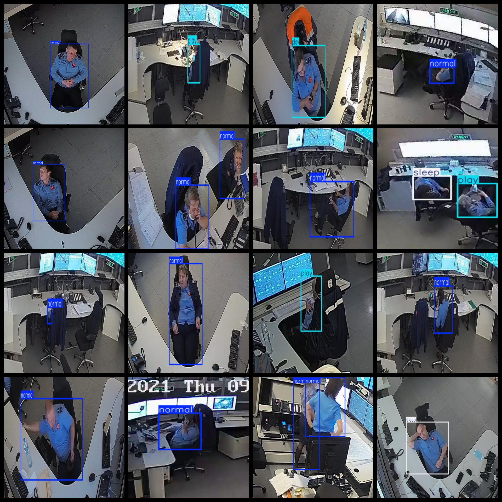

# Sleeping on Duty Detection Dataset 3853 imagesVOC+YOLO format

The dataset for sleep detection is composed of 3853 images in VOC+YOLO format.

Dataset format: Pascal VOC format + YOLO format (the txt file does not contain the split path, it only contains jpg images and corresponding VOC format xml files and yolo format txt files)

Number of Images (jpg file count): 3853

Number of XML files: 3853

Number of txt files: 3853

Number of annotated categories: 3

The Github repository is: datasets_sl

['normal', 'play', 'sleep']

Number of boxes labeled in each category:

Normal Frame Count = 2761

Playbox number = 736

Sleep Frame Count = 847

Total Frames: 4344

Number of images per category:

Normally, the number of images owned is 2344.

play annotated images = 735

Sleep occupies 825 pictures.

Image resolution: Multi-resolution images, such as 542x434, 512x288, etc.

Use the labeling tool: labelImg

Dataset Augmentation: No

Rules for annotation: Draw a rectangle around the category.

Important note: The dataset does not have been divided into training, validation, and testing sets.

Special Disclaimer: This dataset does not guarantee the accuracy of the trained models or weight files.

Annotation and image details are as follows:

## Images

---

Here is a pay link on Stripe (https://buy.stripe.com/3cs8yP7sY87d0vu9AB). Please contact me lonlonago@foxmail.com after funding $89, and I will send you a complete data files, thank you!

